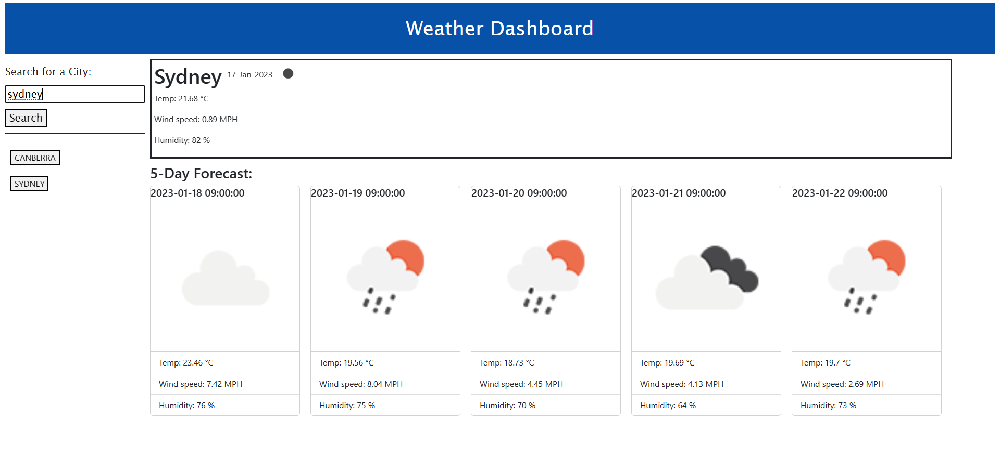

# Calendar app

## Description

This project is an web application that utilises third-party API to retrieve weather information and displays the data in the browser.
The application will retrieve weather data of the desired city based on user's input, and display current/future weather predictions. A list of search history will be generated and displayed on the left side of the page to allow user to retrieve this information. Weather data are stored in the local storage and can be reloaded as needed.

You can access the application at https://sandy5433.github.io/Weather-dashboard/

## Usage

Below is a screenshot of the deployed webpage

Enter the desired city in the search bar on the top left corner and hit "Search". The current weather condition will be displayed across the top of the page. 5-Day Forecast is displayed below the current weather conditions. This search history will also be printed on the side bar which can be retrieved by clicking on the city button.

## Support

Please reach out to Sandy Hung at sandyhung83@yahoo.com.tw if you have any questions or comments regarding this project. Alternatively, head on to my GitHub at https://github.com/Sandy5433 to see more exciting projects.

## Roadmap

New coding projects will be released every Wednesday night. My first project, refactoring html/css code, can be found on my GitHub.

## Contributing

If you would like to contribute to the development of this weather dashboard application, you can reach out to me via the contact details on my portfolio webpage. 

## Authors and acknowledgment

Many thanks to my instructors and tutors from USYD coding bootcamp who stayed back after class to support me on my journey in coding.

## Project status

Completed 17/01/2023
